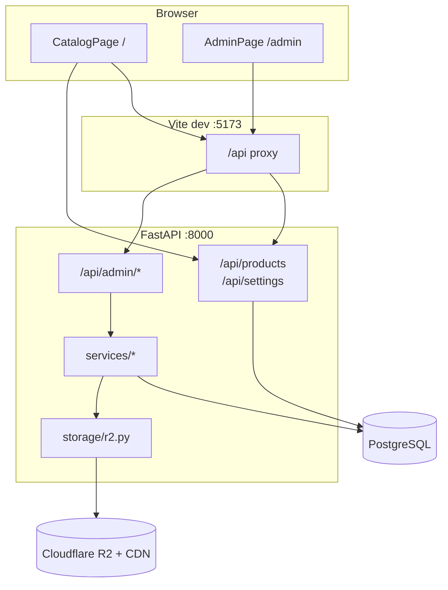

# Architecture

## System diagram



## Backend layers

| Layer | Responsibility |
|-------|----------------|
| `routers/` | HTTP routes, request validation, status codes |
| `schemas.py` | Pydantic models (request/response) |
| `crud.py` | SQLAlchemy queries, filter logic |
| `models.py` | ORM tables |
| `services/` | Business logic (products, images, design #, taxonomy) |
| `storage/r2.py` | S3-compatible upload/delete |
| `auth.py` | Admin API key verification |
| `migrate.py` | Lightweight schema patches on startup |

## Frontend layers

| Layer | Responsibility |
|-------|----------------|
| `pages/` | Route-level views (`CatalogPage`, `AdminPage`) |
| `components/` | Catalog UI (grid, filters, search) |
| `components/admin/` | Admin forms and product table |
| `hooks/useCatalog.js` | Search, filters, product fetch |
| `context/BrandingContext.jsx` | Site settings + CSS theme variables |
| `api/` | HTTP client (`apiFetch`, `apiUpload`) |

## Public catalog flow

1. `BrandingProvider` loads `GET /api/settings` → applies CSS variables (`--brand-*`, `--accent*`).
2. `useCatalog` loads filter options once, then products whenever search/filters change.
3. Search is debounced 300ms; filters apply with AND logic together with search.
4. `ProductCard` renders `image_url` (any host — R2 CDN or external).

## Admin product flow (single)

1. User selects category/subcategory (`TaxonomySelect` → existing or new).
2. Optional design # / name; if empty, API auto-generates on save.
3. Image: **Upload to R2** (multipart → WebP → `put_object`) or **Image URL** (external or CDN).
4. `POST /api/admin/products` with JSON body; `build_product_data()` normalizes fields.
5. Taxonomy warnings require checkbox acknowledgment before submit.

## Bulk upload flow

1. User picks category + subcategory + multiple files.
2. `POST /api/admin/products/bulk-upload` (multipart).
3. Server allocates N sequential design numbers for that pair.
4. For each file: upload to R2, create `Product` row.
5. Design names derived from filenames when possible.

## Design number scheme

Format: `{category-slug}-{subcategory-slug}-{NNNN}`

Example: `porcelain-marble-look-0001`, `0002`, …

- Sequence is **per category + subcategory pair**.
- Legacy/manual numbers (e.g. `TN-1042`) are allowed but do not affect auto-sequence parsing.
- See [DATABASE.md](DATABASE.md).

## R2 object layout

Default (`R2_USE_FIXED_IMAGE_NAME=false`):

```text
{bucket}/
  {category-slug}/
    {subcategory-slug}/
      {design-slug}.webp
```

Multiple products in the same subcategory → **multiple files** in that folder.

If `R2_USE_FIXED_IMAGE_NAME=true`: single `image.webp` per folder (overwrites).

## Image metadata

| `image_storage` | Meaning |
|-----------------|---------|
| `r2` | `image_object_key` set — uploaded via app |
| `r2_linked` | CDN URL matches `R2_PUBLIC_CDN_URL` but no key stored |
| `external` | Other URL (Unsplash, etc.) |
| `none` | No image |

## Security model

- Public read: products + settings (no auth).
- Admin write: shared secret in `X-Admin-Key` header.
- Key stored in browser `sessionStorage` (XSS risk in production — use HTTPS, strong CSP).
- CORS: configurable via `CORS_ORIGINS` (see [ENVIRONMENT.md](ENVIRONMENT.md)).

## Startup sequence

1. `create_all` — create missing tables.
2. `migrate.py` — add `subcategory`, `image_object_key` if missing.
3. Log R2 configured or disabled.

## Known limitations

- No pagination on product lists.
- No Alembic migrations (manual `migrate.py` only).
- `design_number` not unique at DB level (validated in app on create).
- Admin key has no expiry/rotation UI.

See [TROUBLESHOOTING.md](TROUBLESHOOTING.md) and [AI_CONTEXT.md](AI_CONTEXT.md).
